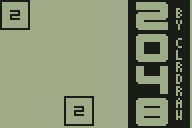
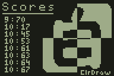
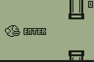
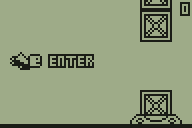
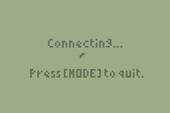
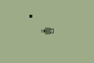
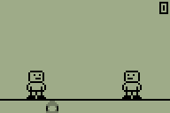
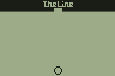

## TI Games

           

## Platform

These programs are built for the Texas Instruments 83+/84 graphing calculator (black and white edition).

## Download

| [2048](2048/2048.8xp?raw=true) | [Blox](blox/blox.8xp?raw=true) | [Don't Step](dont_step/dont_step.8xp?raw=true) | [Fall](fall/fall.8xp?raw=true) | [Flappy Bird](flappy-bird/flappy-bird.8xp?raw=true) | [Iron Pants](iron_pants/iron_pants.8xp?raw=true) | [Pong2P](pong-2p/pong-2p.8xp?raw=true) | [Snake](snake/snake.8xp?raw=true) | [Super Ball Juggling](super_ball_juggling/super_ball_juggling.8xp?raw=true) | [The Line](the_line/the_line.8xp?raw=true) | [Tunnel](tunnel/tunnel.8xp?raw=true) |
| ------------- | ------------- | ------------- | ------------- | ------------- | ------------- | ------------- | ------------- | ------------- | ------------- | ------------- |

## How to Install

* Download TI Connect https://education.ti.com/en/us/software/search/ti-83-plus-family  
* Connect the TI-83+ or TI-84 to the computer  
* Transfer the '.8xp' files to the device using TI Connect  
* Run the program from the [PRGM] menu with the asm() command  
