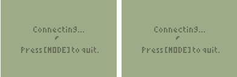

## TI Games

      

## Platform

These programs are built for the Texas Instruments 83+/84 graphing calculator (black and white edition).

## Download

* [2048](2048/2048.8xp)
* [Blox](blox/blox.8xp)
* [Fall](fall/fall.8xp)
* [Flappy Bird](flappy-bird/flappy-bird.8xp)
* [Pong2P](pong-2p/pong-2p.8xp)
* [Snake](snake/snake.8xp)
* [Tunnel](tunnel/tunnel.8xp)

## How to Install

<ul>
<li>Download TI Connect https://education.ti.com/en/us/software/search/ti-83-plus-family</li>
<li>Connect the TI-83+ or TI-84 to the computer</li>
<li>Transfer the '.8xp' file to the device using TI Connect</li>
<li>Run the program from the [PRGM] menu with the asm() command</li>
</ul>
